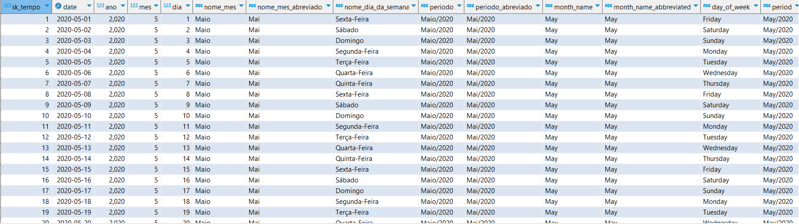

## Sobre
Script SQL para o sistema gerenciador de banco de dados relacional PostgreSQL, o objetivo é gerar a dimensão tempo utilizável em projetos de dados com a modelagem dimensional.
Script de fácil adaptação para diferentes casos de uso.

## Colunas 
As colunas geradas pelo script são:

sk_tempo, "date", ano, mes,	dia, nome_mes, nome_mes_abreviado, nome_dia_da_semana, periodo, periodo_abreviado, ano_mes_numerico, month_name,	month_name_abbreviated,	day_of_week, "period", period_abbreviated.

<p align="center">
  
  <b>Pré-visualização</b>
</p>

OBS: sk_tempo é a chave substituta para fazer as ligações de tabelas de forma otimizada na modelagem dimensional para Data WareHouse.

## Script SQL
```
with
t1 as (
	select
			date_trunc('day', dd)::date as "date",
			extract(YEAR from dd) as ano,
			extract(month from dd) as mes,
			extract(day from dd) as dia,
			extract(ISODOW from dd) as numero_dia_da_semana	
	FROM 	generate_series
	        (date_trunc('month', (current_date - interval '36 months'))::date 
	        ,current_date::date
	        ,'1 day'::interval) dd
)
 
select 
	row_number() over (order by t1."date") as sk_tempo,
 	t1."date",
 	t1.ano,
 	t1.mes,
 	t1.dia,
 	case 
 		when t1.mes = 1 then 'Janeiro'
 		when t1.mes = 2 then 'Fevereiro'
 		when t1.mes = 3 then 'Março'
 		when t1.mes = 4 then 'Abril'
 		when t1.mes = 5 then 'Maio'
 		when t1.mes = 6 then 'Junho'
 		when t1.mes = 7 then 'Julho'
 		when t1.mes = 8 then 'Agosto'
 		when t1.mes = 9 then 'Setembro'
 		when t1.mes = 10 then 'Outubro'
 		when t1.mes = 11 then 'Novembro'
 		when t1.mes = 12 then 'Dezembro'
 		else null
 	end as nome_mes,
 	case 
 		when t1.mes = 1 then 'Jan'
 		when t1.mes = 2 then 'Fev'
 		when t1.mes = 3 then 'Mar'
 		when t1.mes = 4 then 'Abr'
 		when t1.mes = 5 then 'Mai'
 		when t1.mes = 6 then 'Jun'
 		when t1.mes = 7 then 'Jul'
 		when t1.mes = 8 then 'Ago'
 		when t1.mes = 9 then 'Set'
 		when t1.mes = 10 then 'Out'
 		when t1.mes = 11 then 'Nov'
 		when t1.mes = 12 then 'Dez'
 		else null
 	end as nome_mes_abreviado,
 	case 
 		when t1.numero_dia_da_semana = 1 then 'Segunda-Feira'
 		when t1.numero_dia_da_semana = 2 then 'Terça-Feira'
 		when t1.numero_dia_da_semana = 3 then 'Quarta-Feira'
 		when t1.numero_dia_da_semana = 4 then 'Quinta-Feira'
 		when t1.numero_dia_da_semana = 5 then 'Sexta-Feira'
 		when t1.numero_dia_da_semana = 6 then 'Sábado'
 		when t1.numero_dia_da_semana = 7 then 'Domingo'
 		else null
 	end as nome_dia_da_semana,
 	case 
 		when t1.mes = 1 then 'Janeiro' || '/' || extract(YEAR from t1."date")
 		when t1.mes = 2 then 'Fevereiro' || '/' || extract(YEAR from t1."date")
 		when t1.mes = 3 then 'Março' || '/' || extract(YEAR from t1."date")
 		when t1.mes = 4 then 'Abril' || '/' || extract(YEAR from t1."date")
 		when t1.mes = 5 then 'Maio' || '/' || extract(YEAR from t1."date")
 		when t1.mes = 6 then 'Junho' || '/' || extract(YEAR from t1."date")
 		when t1.mes = 7 then 'Julho' || '/' || extract(YEAR from t1."date")
 		when t1.mes = 8 then 'Agosto' || '/' || extract(YEAR from t1."date")
 		when t1.mes = 9 then 'Setembro' || '/' || extract(YEAR from t1."date")
 		when t1.mes = 10 then 'Outubro' || '/' || extract(YEAR from t1."date")
 		when t1.mes = 11 then 'Novembro' || '/' || extract(YEAR from t1."date")
 		when t1.mes = 12 then 'Dezembro' || '/' || extract(YEAR from t1."date")
 		else null
 	end as periodo,
 	case 
 		when t1.mes = 1 then 'Jan' || '/' || extract(YEAR from t1."date")
 		when t1.mes = 2 then 'Fev' || '/' || extract(YEAR from t1."date")
 		when t1.mes = 3 then 'Mar' || '/' || extract(YEAR from t1."date")
 		when t1.mes = 4 then 'Abr' || '/' || extract(YEAR from t1."date")
 		when t1.mes = 5 then 'Mai' || '/' || extract(YEAR from t1."date")
 		when t1.mes = 6 then 'Jun' || '/' || extract(YEAR from t1."date")
 		when t1.mes = 7 then 'Jul' || '/' || extract(YEAR from t1."date")
 		when t1.mes = 8 then 'Ago' || '/' || extract(YEAR from t1."date")
 		when t1.mes = 9 then 'Set' || '/' || extract(YEAR from t1."date")
 		when t1.mes = 10 then 'Out' || '/' || extract(YEAR from t1."date")
 		when t1.mes = 11 then 'Nov' || '/' || extract(YEAR from t1."date")
 		when t1.mes = 12 then 'Dez' || '/' || extract(YEAR from t1."date")
 		else null
 	end as periodo_abreviado,
 	cast(extract(year from t1."date")||lpad(extract(month from t1."date")::text,2,'0') as integer) as ano_mes_numerico,
 	case 
 		when t1.mes = 1 then 'January'
 		when t1.mes = 2 then 'February'
 		when t1.mes = 3 then 'March'
 		when t1.mes = 4 then 'April'
 		when t1.mes = 5 then 'May'
 		when t1.mes = 6 then 'June'
 		when t1.mes = 7 then 'July'
 		when t1.mes = 8 then 'August'
 		when t1.mes = 9 then 'September'
 		when t1.mes = 10 then 'October'
 		when t1.mes = 11 then 'November'
 		when t1.mes = 12 then 'December'
 		else null
 	end as month_name,
 	case 
 		when t1.mes = 1 then 'Jan'
 		when t1.mes = 2 then 'Feb'
 		when t1.mes = 3 then 'Mar'
 		when t1.mes = 4 then 'Apr'
 		when t1.mes = 5 then 'May'
 		when t1.mes = 6 then 'Jun'
 		when t1.mes = 7 then 'Jul'
 		when t1.mes = 8 then 'Aug'
 		when t1.mes = 9 then 'Sep'
 		when t1.mes = 10 then 'Oct'
 		when t1.mes = 11 then 'Nov'
 		when t1.mes = 12 then 'Dec'
 		else null
 	end as month_name_abbreviated,
 	case 
 		when t1.numero_dia_da_semana = 1 then 'Monday'
 		when t1.numero_dia_da_semana = 2 then 'Tuesday'
 		when t1.numero_dia_da_semana = 3 then 'Wednesday'
 		when t1.numero_dia_da_semana = 4 then 'Thursday'
 		when t1.numero_dia_da_semana = 5 then 'Friday'
 		when t1.numero_dia_da_semana = 6 then 'Saturday'
 		when t1.numero_dia_da_semana = 7 then 'Sunday'
 		else null
 	end as day_of_week,
 	case 
 		when t1.mes = 1 then 'January' || '/' || extract(YEAR from t1."date")
 		when t1.mes = 2 then 'February' || '/' || extract(YEAR from t1."date")
 		when t1.mes = 3 then 'March' || '/' || extract(YEAR from t1."date")
 		when t1.mes = 4 then 'April' || '/' || extract(YEAR from t1."date")
 		when t1.mes = 5 then 'May' || '/' || extract(YEAR from t1."date")
 		when t1.mes = 6 then 'June' || '/' || extract(YEAR from t1."date")
 		when t1.mes = 7 then 'July' || '/' || extract(YEAR from t1."date")
 		when t1.mes = 8 then 'August' || '/' || extract(YEAR from t1."date")
 		when t1.mes = 9 then 'September' || '/' || extract(YEAR from t1."date")
 		when t1.mes = 10 then 'October' || '/' || extract(YEAR from t1."date")
 		when t1.mes = 11 then 'November' || '/' || extract(YEAR from t1."date")
 		when t1.mes = 12 then 'December' || '/' || extract(YEAR from t1."date")
 		else null
 	end as "period",
 	case 
 		when t1.mes = 1 then 'Jan' || '/' || extract(YEAR from t1."date")
 		when t1.mes = 2 then 'Feb' || '/' || extract(YEAR from t1."date")
 		when t1.mes = 3 then 'Mar' || '/' || extract(YEAR from t1."date")
 		when t1.mes = 4 then 'Apr' || '/' || extract(YEAR from t1."date")
 		when t1.mes = 5 then 'May' || '/' || extract(YEAR from t1."date")
 		when t1.mes = 6 then 'Jun' || '/' || extract(YEAR from t1."date")
 		when t1.mes = 7 then 'Jul' || '/' || extract(YEAR from t1."date")
 		when t1.mes = 8 then 'Aug' || '/' || extract(YEAR from t1."date")
 		when t1.mes = 9 then 'Sep' || '/' || extract(YEAR from t1."date")
 		when t1.mes = 10 then 'Oct' || '/' || extract(YEAR from t1."date")
 		when t1.mes = 11 then 'Nov' || '/' || extract(YEAR from t1."date")
 		when t1.mes = 12 then 'Dec' || '/' || extract(YEAR from t1."date")
 		else null
 	end as period_abbreviated
from t1
```
